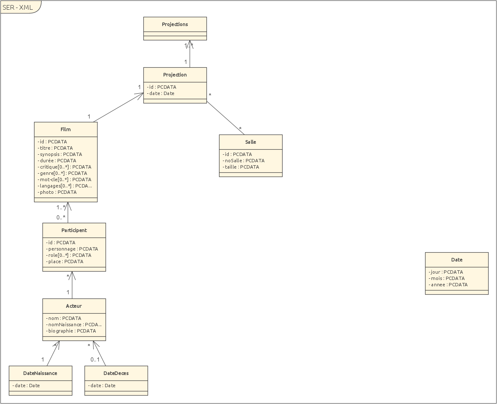
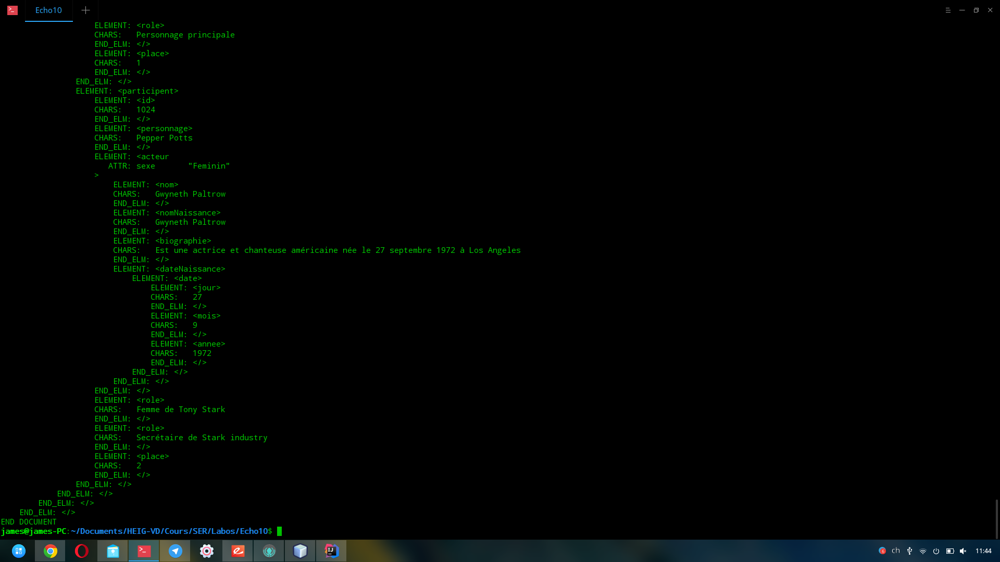
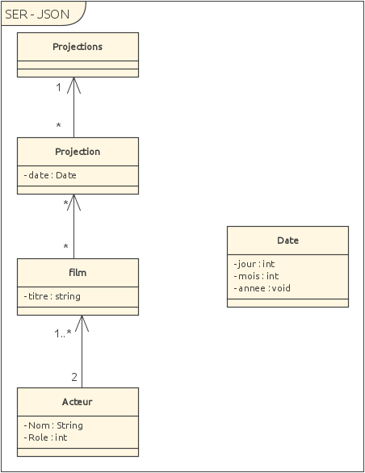

# SER - Rapport Labo 1

## Introduction

Ce laboratoire avait pour but de nous faire créé une DTD et sont fichier XML. La conception à nécessité une reflection sur la *redondance* et la *visibilité* du fichier. 

Par la suite nous avons du créé un fichier JSON contenant un jeu de donnée plus faible.

## Graphe



## DTD

```dtd
<!ELEMENT projections (projection)*>
<!ELEMENT projection (id, date, salle, film)>
<!ELEMENT film (id, titre, synopsis, durée, (critique*), (genre*), (mot-cle*), (langages*), photo, (participent*))>
<!ELEMENT participent (id,personnage, acteur, (role*), place)>
<!ELEMENT acteur (nom, nomNaissance, biographie, dateNaissance, dateDeces?)>
<!ELEMENT photo EMPTY>
<!ELEMENT date (jour,mois,annee)>
<!ELEMENT salle (id, noSalle, taille)>

<!ELEMENT id (#PCDATA)>
<!ELEMENT titre (#PCDATA)>
<!ELEMENT synopsis (#PCDATA)>
<!ELEMENT durée (#PCDATA)>
<!ELEMENT critique (#PCDATA)>
<!ELEMENT genre (#PCDATA)>
<!ELEMENT mot-cle (#PCDATA)>
<!ELEMENT langages (#PCDATA)>
<!ELEMENT personnage (#PCDATA)>
<!ELEMENT role (#PCDATA)>
<!ELEMENT place (#PCDATA)>
<!ELEMENT nom (#PCDATA)>
<!ELEMENT nomNaissance (#PCDATA)>
<!ELEMENT jour (#PCDATA)>
<!ELEMENT mois (#PCDATA)>
<!ELEMENT annee (#PCDATA)>
<!ELEMENT noSalle (#PCDATA)>
<!ELEMENT taille (#PCDATA)>
<!ELEMENT biographie (#PCDATA)>
<!ELEMENT dateNaissance (date)>
<!ELEMENT dateDeces (date)>

<!ATTLIST photo url CDATA #REQUIRED> 
<!ATTLIST acteur sexe (Masculin|Feminin) #REQUIRED>
```

Nous avons conçu cette DTD de façon à ce que notre fichier XML soit simple et lisible. Il comportera des redondance mais facilite l'écriture et la lecture du fichier *brute*.

Tous les éléments sont composés de sous élément et sont finalement des élément comportants un attributs (#PCDATA). 

L'élément date est utilisé à plusieurs reprise pour la decès, la naissance et les dates de scéance. 

Le champs *photo* pour les films est uniquement composé attributs interne qui est un *url* qui est obligatoire.

Le sexe des acteurs doit lui aussi être donné par un attributs interne et peut être uniquement *Masculin* ou *Feminin* et est obligatoire.

Nous avons décidé de mettre les *id* en tant que élément sans précisé qu'il soit unique ou id car si on fait ceci, on se retrouve bloquer comme par exemple: "un acteur ne pourra pas participé à plusieurs film car l'id sera déjà utilisé". Ce problème est du à notre conception qui est de favorisé la visibilité à la redondance.

## Exemple XML

Pour cette exemple, nous avons créé les scéances pour le film *Iron Man 3* et *Good Morning England*. 

```xml
<?xml version="1.0" ?>
<!DOCTYPE projections SYSTEM "cinema.dtd">
<projections>
  <!--Zero or more repetitions:-->
  <projection>
    <id>1</id>
    <date>
      <jour>5</jour>
      <mois>3</mois>
      <annee>2018</annee>
    </date>
    <salle>
      <id>1</id>
      <noSalle>1</noSalle>
      <taille>40</taille>
    </salle>
    <film>
      <id>164</id>
      <titre>Good Morning England</titre>
      <synopsis>Voila voila</synopsis>
      <durée>120</durée>
      <!--Zero or more repetitions:-->
      <critique>Très bien</critique>
      <critique>Bien aimé</critique>
      <!--Zero or more repetitions:-->
      <genre>Comédie Musical</genre>
      <genre>Drama</genre>
      <!--Zero or more repetitions:-->
      <mot-cle>England</mot-cle>
      <mot-cle>Musique</mot-cle>
      <mot-cle>Rock</mot-cle>
      <!--Zero or more repetitions:-->
      <langages>Anglais</langages>
      <langages>Français</langages>
      <photo url="www.google.ch/goodmornigengland.png"/>
      <!--Zero or more repetitions:-->
      <participent>
        <id>170</id>
        <personnage>Carl</personnage>
        <acteur sexe="Masculin">
          <nom>Tom Sturridge</nom>
          <nomNaissance>Tom Sturridge</nomNaissance>
          <biographie>Tom Sturridge né le 21 décembre 1985 à Lambeth en Angleterre,
              est un acteur anglais, connu pour avoir joué dans Adorable Julia, Like
              Minds, et pour son rôle dans Good Morning England.</biographie>
          <dateNaissance>
            <date>
              <jour>21</jour>
              <mois>12</mois>
              <annee>1985</annee>
            </date>
          </dateNaissance>
        </acteur>
        <!--Zero or more repetitions:-->
        <role>Personnage principale</role>
        <role>Petit paumé</role>
        <place>1</place>
      </participent>
      <participent>
        <id>999</id>
        <personnage>le Compte</personnage>
        <acteur sexe="Masculin">
          <nom>Philip Seymour Hoffman </nom>
          <nomNaissance>Philip Seymour Hoffman </nomNaissance>
          <biographie>Il amorce sa carrière d'acteur en 1991 et, l'année suivante, 
            commence à apparaître dans des films. Il acquiert une certaine 
            reconnaissance de son travail pour ses seconds rôles dans Le Temps d'un 
            week-end (1992), Twister (1996), Boogie Nights (1997), The Big Lebowski 
            (1998), Docteur Patch (1998), Magnolia (1999), Le Talentueux Mr Ripley (1999),
            Presque célèbre (2000), Dragon Rouge (2002), La 25e Heure (2002) et Retour à 
            Cold Mountain (2003).</biographie>
          <dateNaissance>
            <date>
              <jour>23</jour>
              <mois>07</mois>
              <annee>1967</annee>
            </date>
          </dateNaissance>
          <dateDeces>
              <date>
                  <jour>2</jour>
                  <mois>02</mois>
                  <annee>2014</annee>
              </date>
          </dateDeces>
        </acteur>
        <!--Zero or more repetitions:-->
        <role>Dj</role>
        <role>Habitant du bateau</role>
        <place>2</place>
      </participent>
    </film>
  </projection>
  <!--Zero or more repetitions:-->
  <projection>
    <id>2</id>
    <date>
      <jour>6</jour>
      <mois>3</mois>
      <annee>2018</annee>
    </date>
    <salle>
      <id>2</id>
      <noSalle>2</noSalle>
      <taille>38</taille>
    </salle>
    <film>
      <id>268</id>
      <titre>Iron Man 3</titre>
      <synopsis>C'est ca</synopsis>
      <durée>145</durée>
      <!--Zero or more repetitions:-->
      <critique>Bof</critique>
      <critique>Super bien</critique>
      <!--Zero or more repetitions:-->
      <genre>Action</genre>
      <genre>Fiction</genre>
      <!--Zero or more repetitions:-->
      <mot-cle>Iron</mot-cle>
      <mot-cle>Marvel</mot-cle>
      <mot-cle>Man</mot-cle>
      <!--Zero or more repetitions:-->
      <langages>Anglais</langages>
      <langages>Français</langages>
      <photo url="http://www.lavisqteam.fr/wp-content/uploads/2013/10/iron-man-3-poster.jpg"/>
      <!--Zero or more repetitions:-->
      <participent>
        <id>12</id>
        <personnage>Tony Stark</personnage>
        <acteur sexe="Masculin">
          <nom>Robert Downey Jr.</nom>
          <nomNaissance>Robert Downey Jr.</nomNaissance>
          <biographie>Révélé à la fin des années 1980, il est nommé à l'Oscar du meilleur 
            acteur en 1993 pour son interprétation de Charlie Chaplin dans Chaplin, mais
            connaît ensuite un passage à vide du fait de graves problèmes de drogue et 
            d'alcool. Rétabli, il opère un retour en force et devient, en 2008, 
            l'interprète d'Iron Man dans les films des studios Marvel. Ce rôle, qu'il 
            interprète dans la trilogie Iron Man ainsi que dans Avengers, Avengers : L'Ère
            d'Ultron, Captain America: Civil War, Spider-Man: Homecoming, Avengers: 
            Infinity War et Avengers 4 lui vaut de devenir l'un des acteurs les mieux 
            payés au monde</biographie>
          <dateNaissance>
            <date>
              <jour>4</jour>
              <mois>4</mois>
              <annee>1965</annee>
            </date>
          </dateNaissance>
        </acteur>
        <!--Zero or more repetitions:-->
        <role>Personnage principale</role>
        <place>1</place>
      </participent>
      <participent>
        <id>1024</id>
        <personnage>Pepper Potts</personnage>
        <acteur sexe="Feminin">
          <nom>Gwyneth Paltrow</nom>
          <nomNaissance>Gwyneth Paltrow</nomNaissance>
          <biographie>Est une actrice et chanteuse américaine née le 27 septembre 1972 à 
            Los Angeles </biographie>
          <dateNaissance>
            <date>
              <jour>27</jour>
              <mois>9</mois>
              <annee>1972</annee>
            </date>
          </dateNaissance>
        </acteur>
        <!--Zero or more repetitions:-->
        <role>Femme de Tony Stark</role>
        <role>Secrétaire de Stark industry</role>
        <place>2</place>          
      </participent>
    </film>
  </projection>
</projections>
```

### Résultat verification avec Echo10



## JSON

Nous avons décidé de concerver une structure stricte même pour un petit jeu de donnée pour pouvoir facilement atteindre des données.

```json
{"projections":
	{
	  "projection":[
	    {
	     "date":
  	   {
  	    "jour": 5,
  	    "mois": 3,
  	    "année": 2018
  	   },
  	   "film":
	     {
	      "titre": "Good Morning England",
	      "acteurs":
	        [
	          {
	            "Nom":"Tom Sturridge",
	            "Role": 1
	          },
	          {
	            "Nom": "Philip Seymour Hoffman",
	            "Role": 2
	          }
	        ]
	    }
	  },
	  {
	    "date":
  	   {
  	    "jour": 6,
  	    "mois": 3,
  	    "année": 2018
  	   },
  	   "film":
	     {
	      "titre": "Iron Man 3",
	      "acteurs":
	        [
	          {
	            "Nom":"Robert Downey Jr.",
	            "Role": 1
	          },
	          {
	            "Nom": "Gwyneth Paltrow",
	            "Role": 2
	          }
	        ]
	    }
	  }]
	}
}
```

### Arbre JSON



## Conclusion

Ce laboratoire à nécessité de la rigeure lors de la conception de la DTD. Les erreurs de systaxe arrivent rapidement et la visibilité de gros fichier devient rapidement compliqué.

Nous avons rencontré quelque problème concernant la syntaxe du JSON, il est assez rapide d'avoir une virgule ou un accolade qui pose problème et les messages d'erreurs ne sont pas toujours très clairs.